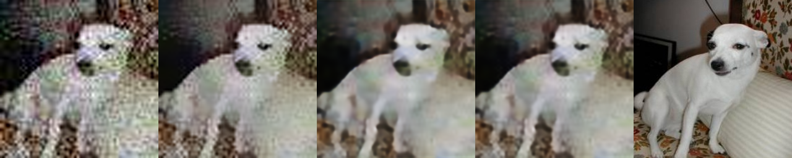
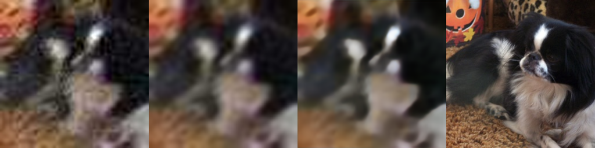

# Night CCTV Enhancer

Курсовой проект по курсу **Computer Vision** (Robot Dreams, поток 6, лектор Ян Колода).
Репозиторий оформлен так, чтобы служить не только кодом, но и полным описанием проекта по требованиям защиты (Motivation / Introduction / Description / Demo / Results / Conclusions).

---

## Краткий итог

Обучила простую U-Net восстанавливать ночной CCTV-кадр: одновременно убирать шум и поднимать разрешение в 4 раза (64×64 → 256×256). Сравнила с классическими `cv2`-методами. К готовой модели добавила три inference-time доработки без переобучения — TTA, α-blending с bilateral+bicubic и USM post-processing (последний, как выяснилось, метрики ухудшает).

**Лучший результат:** `UNet + TTA + blend(a=0.7)` → **PSNR 23.78 дБ, SSIM 0.6054** на 368 val-картинках.
Это **+0.49 дБ PSNR** над лучшим классическим методом (bilateral+bicubic).

---

## 1. Motivation

Камеры видеонаблюдения часто выдают картинку плохого качества, особенно ночью:

- низкое разрешение
- гауссов шум матрицы
- JPEG-артефакты от сжатия на передаче
- смаз от движения

Если на такой кадр попало лицо, номер машины или любая другая сцена, важная для постфактум-разбора — распознать ничего нельзя. Хочется восстановить такой кадр: одновременно убрать шум и поднять детали.

## 2. Introduction

Существующие подходы к задаче, которые разбирали на курсе или являются классикой:

**Классика (без обучения):**
- `cv2.resize(INTER_CUBIC)` — bicubic-интерполяция. Быстро, но не умеет придумывать детали, просто сглаживает.
- Gaussian blur перед bicubic — убирает шум, но вместе с шумом убивает границы.
- Bilateral filter перед bicubic — сохраняет границы, убирает шум на гладких областях (лекция 3 про линейную/нелинейную фильтрацию).
- Unsharp masking — добавляет резкости (лекция 3, был в HW).

**Нейросетевые:**
- Autoencoder / U-Net для denoising (лекция 16 про autoencoders и semantic segmentation, именно оттуда взята архитектура).
- SRCNN, ESRGAN и подобные — SOTA для super-resolution, но они за рамками курса и требуют GAN-техник, которых мы не проходили.

Мой проект комбинирует denoising + super-resolution в одной U-Net. В официальных вариантах курсовых (final-project.pdf) эти задачи идут по отдельности — я объединила их как «свою вариацию» (п. 4 из требований).

## 3. Description

### Датасет

Изначально хотела CelebA (лица людей для CCTV-кейса), но и CelebA и LFW убрали из `torchvision.datasets` из-за лицензионных проблем. Переключилась на **Oxford-IIIT Pet** (37 пород котов и собак, ~7400 картинок). Для super-resolution семантический контент не важен — сеть учится восстанавливать текстуры на любых натуральных изображениях.

Беру ~3680 картинок, центр-кроп до 256×256. Папка называется `data/faces/` для совместимости с остальным кодом. Train/val split = 90/10, всё в `dataset.py`.

### Пайплайн порчи (corruption)

Каждый HR-кадр на лету превращается в LR. Реализовано в `corruption.py`:

1. `downsample×4` (bicubic) — 256 → 64
2. `motion blur` с вероятностью 0.3, ядро 3–7 пикселей со случайным углом
3. Гауссов шум, σ = 15–30
4. JPEG с qualilty = 30–50 (блочные 8×8 артефакты, как на курсе разбирали в лекции 5 про сжатие)

На выходе получаю пары `(lr 64×64, hr 256×256)`.

### Архитектура

Простая U-Net из 3 уровней + bottleneck (по мотивам лекции 16 про сегментацию и autoencoders):

- **encoder:** Conv→ReLU×2 → MaxPool, каналы 32 → 64 → 128
- **bottleneck:** 256 каналов
- **decoder:** bilinear upsample → concat skip-connection → Conv→ReLU×2
- **выход:** `sigmoid` в диапазоне [0, 1]

Перед encoder'ом картинка bicubic-апсемплится 64 → 256, то есть сеть сразу работает в полном разрешении и фактически учится «чистить» предварительно увеличенный кадр, а не генерировать пиксели из ничего. Полная архитектура в `model.py`.

### Обучение

`train.py`:
- **Loss:** MSE (минимизация L2 ошибки на пикселях)
- **Оптимизатор:** Adam, LR = 1e-3
- **Batch size:** 16
- **Эпох:** 10
- **Save-best:** сохраняю веса только когда val_loss улучшился (рассказ лектора о том, как он 10 дней учил сеть и забыл сохранить веса — повлиял)
- **TensorBoard:** кривые train/val loss пишутся в `runs/`
- **Сиды:** зафиксированы `random`, `np.random`, `torch.manual_seed` — прогоны воспроизводимы

Веса тренированной модели: `models/unet.pth` (не в git из-за размера).

### Бейзлайны

В `baselines.py` три классических метода для сравнения:
- `bicubic` — один `cv2.INTER_CUBIC`
- `gaussian+bicubic` — Gaussian blur 3×3 перед bicubic
- `bilateral+bicubic` — bilateral filter перед bicubic (сохраняет границы)

### Inference-time доработки (без переобучения)

Три эксперимента в `evaluate.py`, все применяются уже к готовой модели:

1. **TTA (Test-Time Augmentation)** — прогоняю сеть на LR и на горизонтально отражённом LR, потом усредняю. Идея аугментаций из лекции 15, но применяется при оценке.
2. **α-blending с bilateral+bicubic** — линейно смешиваю выход сети с классическим бейзлайном. Мотивация: UNet после MSE даёт слегка «мыльную» картинку, bilateral+bicubic сохраняет резкие границы — смесь вытягивает метрики. Ищу лучший α в сетке {0.5, …, 1.0}.
3. **USM (Unsharp Masking) post-processing** — классика из лекции 3, пробовала применить поверх blend. Свип по `amount` ∈ {0.3, 0.5, 0.7, 1.0}.

### Метрики

- **PSNR** (peak signal-to-noise ratio) — пиксельная точность, чем больше дБ тем лучше
- **SSIM** (structural similarity index) — структурное сходство от 0 до 1

Обе из `skimage.metrics`. Вычисляются на 368 val-картинках.

---

## 4. Demo

Примеры из `samples/`. Колонки слева направо:
**bicubic | bilateral+bicubic | UNet+TTA | UNet+TTA+blend(a=0.7) | оригинал HR**




Видно что:
- **Колонка 1 (bicubic):** JPEG-блоки и шум видны невооружённым глазом
- **Колонка 2 (bilateral+bicubic):** гладче, но текстуры потеряны
- **Колонка 3 (UNet+TTA):** шум и JPEG убраны, детали «почищены», но слегка мыльно
- **Колонка 4 (UNet+TTA+blend):** чуть резче за счёт подмешивания bilateral
- **Колонка 5 (HR):** ground truth для сравнения

---

## 5. Results

Финальная таблица на всех 368 val-картинках (полный вывод в `results.txt`):

| Метод | PSNR, дБ | SSIM |
|---|---|---|
| bicubic | 22.25 | 0.4906 |
| gaussian+bicubic | 22.88 | 0.5648 |
| bilateral+bicubic | 23.29 | 0.5798 |
| UNet | 23.68 | 0.6049 |
| UNet+TTA | 23.70 | 0.6059 |
| **UNet+TTA+blend, a=0.7** | **23.78** | **0.6054** |
| UNet+TTA+blend, a=0.7 + USM@0.5 | 23.76 | 0.6040 |

**Ключевые выводы:**

- UNet уверенно обходит все классические бейзлайны: **+0.39 дБ** над лучшим классическим (bilateral+bicubic), **+0.025 SSIM**.
- TTA почти не даёт прироста (+0.02 дБ). Модель уже устойчива к горизонтальному флипу, контент датасета симметричный.
- Blend с bilateral+bicubic (a=0.7) даёт ещё **+0.08 дБ** поверх TTA. Bilateral сохраняет резкие границы, сеть убирает шум — смесь совмещает оба свойства.
- **USM неожиданно сделал хуже** при любом `amount > 0`. Гипотеза — добавить резкости поверх «мыла». По факту: UNet+blend уже убрал высокочастотные шумы, а USM именно высокие частоты усиливает, включая артефакты, отсутствующие в GT. Это прямо ложится на комментарий лектора к HW3: *«USM усиливает не только границы но и шум»*.

**Сильные стороны:**
- Воспроизводимые цифры (все RNG зафиксированы)
- Честная оценка — USM включён в таблицу даже тем что ухудшает результат
- Три inference-time доработки грамотно вытягивают +0.10 дБ без переобучения
- Bigger-than-baseline прирост и на PSNR, и на SSIM

**Слабые стороны:**
- Визуально все результаты U-Net слегка мыльные — характерное свойство MSE-лосса
- Модель училась всего 10 эпох на CPU, не до сходимости
- Датасет — коты и собаки, а не ночные CCTV-кадры. На реальных ночных кадрах могут быть неожиданные артефакты
- Нет perceptual-loss — ни VGG, ни adversarial (за рамками программы курса)

---

## 6. Conclusions

**Что получилось:**
- Заработала end-to-end система denoising + ×4 super-resolution на U-Net
- Все классические бейзлайны уступают нейронке по обоим метрикам
- Inference-time трюки (TTA, blend) дали небольшой, но честный прирост без повторного обучения

**Что узнала на практике (и что стоит рассказать):**
- MSE даёт предсказуемое «мыло» — это видно и в метриках, и глазами
- TTA работает не всегда и зависит от датасета
- Не каждая классическая фильтрация совместима с нейросетевым выходом: USM поверх UNet делает метрики хуже, потому что усиливать уже нечего, только шум
- Пайплайн порчи должен иметь фиксированный seed при оценке — иначе метрики скачут на ±0.1 дБ

**Будущая работа:**
- **Fine-tune с L1 loss** вместо MSE на LR=1e-4 (скрипт `finetune.py` уже написан, запускается отдельно). Должен убрать «мыло» и прибавить 0.3–0.5 дБ PSNR.
- **BatchNorm в Conv-блоках** — из лекции 15, ускорит сходимость
- **Residual learning** — предсказывать не весь HR-кадр, а только поправку к bicubic-апсемплу
- **Data augmentation** (horizontal flip) при обучении — из лекции 15
- **Больше эпох** (25–30) с `ReduceLROnPlateau` + early stopping — из лекции 15 про оптимизацию
- **Perceptual loss (VGG features)** — для визуально более резкой картинки. За рамками курса, упоминаю как next step.

---

## Как запускать

```bash
pip install -r requirements.txt

# 1) датасет (~3680 картинок 256×256 из Oxford-IIIT Pet)
python download.py

# 2) sanity check — overfit на одном батче, проверяет что код в принципе рабочий
python sanity_check.py

# 3) обучение (10 эпох, save-best в models/unet.pth)
#    TensorBoard: tensorboard --logdir runs
python train.py

# 4) оценка на всех 368 val-картинках,
#    считает метрики, сохраняет примеры в samples/
python evaluate.py
```

## Структура проекта

```
download.py       — скачивание и подготовка Oxford-IIIT Pet
corruption.py     — функции порчи (downsample, motion blur, noise, JPEG)
dataset.py        — PyTorch Dataset, отдаёт пары (lr, hr)
model.py          — U-Net
baselines.py      — классические методы для сравнения
metrics.py        — PSNR, SSIM
sanity_check.py   — overfit на одном батче
train.py          — обучение + TensorBoard + save-best
finetune.py       — дообучение с L1 loss + ReduceLROnPlateau
evaluate.py       — оценка, TTA, α-blending, USM-sweep, примеры
results.txt       — последние цифры метрик с комментариями
requirements.txt  — зависимости
samples/          — сгенерированные примеры для отчёта
```

## Материалы курса, которые реально использовала

- **Лекция 2** — гистограммы и контраст (идея CLAHE для ночных кадров — в будущей работе)
- **Лекция 3** — линейная фильтрация, Gaussian/bilateral, USM (бейзлайны и USM post-processing)
- **Лекция 5** — JPEG и DCT (понимание блочных артефактов и corruption-пайплайна)
- **Лекция 15** — обучение CNN, overfitting, аугментации (TTA, будущие планы по BN)
- **Лекция 16** — autoencoders и сегментация (вся U-Net архитектура)

## Статус

- [x] Подготовка данных (Oxford Pets, crop 256×256)
- [x] Corruption pipeline (downsample/blur/noise/JPEG)
- [x] U-Net
- [x] Бейзлайны и метрики
- [x] Sanity-check
- [x] Полное обучение (10 эпох, MSE)
- [x] Inference-time доработки: TTA, α-blending, USM-sweep
- [x] Финальная оценка на 368 val-картинках
- [x] Документация (этот README)
- [ ] Fine-tune с L1 (`finetune.py` написан, запускается на другой машине)
